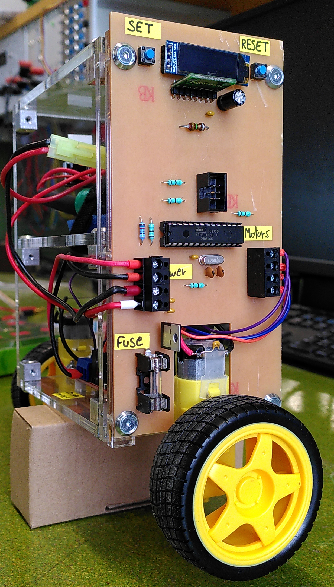

# robot-self-balancing

A self balancing robot made in [ETML](https://www.etml.ch/formations/automaticien.html)
was the final project of my CFC formation as automatician.

## PCB

The pcb has been designed with [KiCad](https://en.wikipedia.org/wiki/KiCad).
A very nice open-source software !

### Schematic

### PCB

## Mechanic

The mechanic design is made with [solid works](https://en.wikipedia.org/wiki/SolidWorks)

## Software

To compile the [code](software/main.ino),
we need the [IDE Arduino](https://www.arduino.cc/en/software)

## In-details documentation could be found here

- [The requirements](documentation/partlist)
- [full documentation](documentation/documentation_robot_self_balancing_all.pdf)

## Ressources

- [French channel](https://www.youtube.com/channel/UCe3v5cVACw-5BKQOcwUaM8w)
- An other [Self-Balancing Robot](https://www.instructables.com/Arduino-Self-Balancing-Robot-1/)

